# System Requirements Specifications #

Version 1.0.0 approved

Prepared by Kim Lehtinen

16.3.2020

# 1 Introduction #

## 1.1 Purpose ##
This is a Software Requirements Specification for the mobile application Mood2Day.

## 1.2 Document Conventions ##
This SRS document is based on wontons SRS template that can be found here https://github.com/wontonst/system-requirements-specification-markdown-srs-md/blob/master/srs.md . Wonton's template on the other hand, is based on Institute of Electrical and Electronics Engineers (IEEE) System Requirements Specifications (SRS).

## 1.3 Glossary
Explain words and terms

## 1.4 Intended Audience and Reading Suggestions ##
Normal users that want to keep track of how they feel during a day.

## 1.5 Product Scope ##
Mood2Day is a mobile application that anyone can use to keep track of their mood and accomplishments for each day. They can also see statistics for current week, and also for each year.

## 1.6 References ##
Mood2Day website:
https://kim3z.github.io/univaasa-mobile-app-course/

Mood2Day Github page:
https://github.com/kim3z/univaasa-mobile-app-course

SRS template:
https://github.com/wontonst/system-requirements-specification-markdown-srs-md/blob/master/srs.md

React native firebase:
https://github.com/invertase/react-native-firebase/blob/master/LICENSE

# 2 Overall Description #

## 2.1 Product Perspective ##
Mood2Day is made for anyone that want to keep track of their mood and tasks that are achieved each day. This data can be tracked, and helps the user to keep track of their mental health and see how days are spent.

This is an open source school project, created by Kim Lehtinen. Since it's built using React Native, it's developed both for Android and iOS. This software has only been tested on Android so far, but should work on iOS as well.

## 2.2 Product Functions ##
User:
- Login: Login user using Firebase.
- Register: Register user using Firebase.
- Logout: Logout user

Mood:
- Create: create a new mood with information about a day in a user's life.
- Update: update mood.
- Delete: delete mood.
- List moods: List of moods with a teaser showing date and overall mood for that day.

Stats:
- Stats this week: show overall mood stats for current week.
- Stats per year: show average overall mood stats for each month for selected year (current year by default).

Main pages (app tabs):
- Moods: list of moods showing teaser for each mood
- New mood: create a new mood
- Stats: overall mood stats

## 2.3 User Classes and Characteristics ##
Normal users that want to keep track of their mood and achievements per day.

## 2.4 Operating Environment ##
- Android 
- iOS (Not tested, but framework supports it)

## 2.5 Design and Implementation Constraints ##
React Native, which is a cross platform mobile application framework, is used to develop Mood2Day application. The programming language used is JavaScript. Mood2Day uses Firebase to authenticate users, and Firestore NoSQL cloud database to store user data.

## 2.6 User Documentation ##
Wiki?

## 2.7 Assumptions and Dependencies ##
Mood2Day is built using React Native, which is based on JavaScript. Therefore, it requires Node.js and react-native to be installed for building the application.

# 3 External Interface Requirements #

## 3.1 User Interfaces ##

### 1. Login Page:
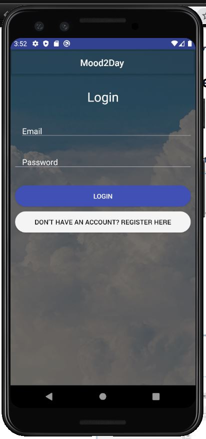

### 2. Register Page:
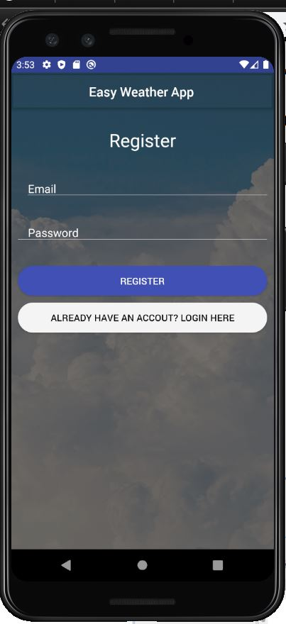

### 3. Moods Page/Tab:
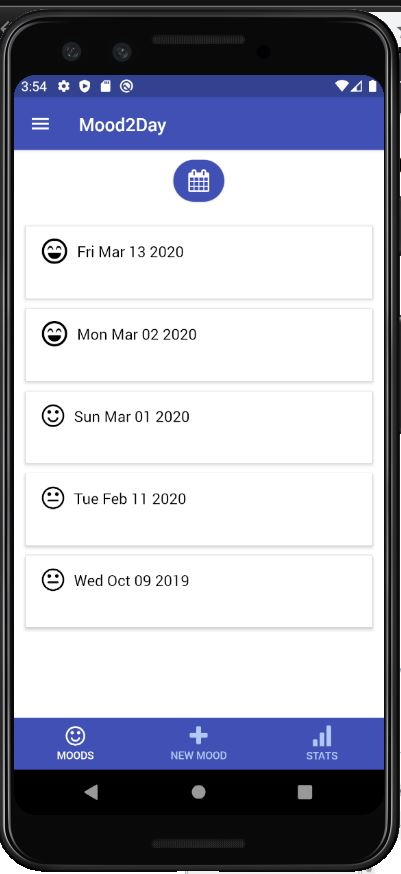

### 4. New mood Page/Tab:
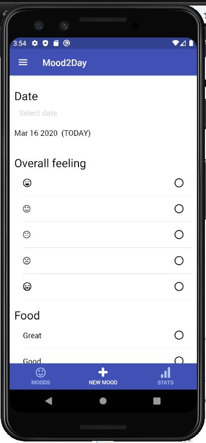

### 5. Stats Page/Tab:
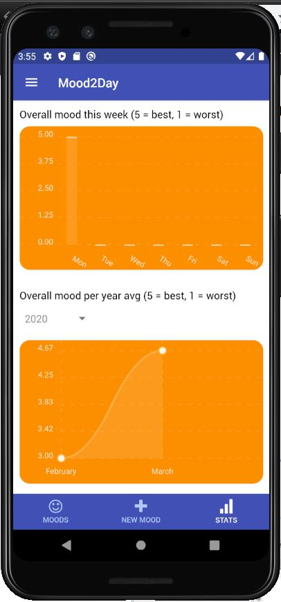

### 6. Single Mood:
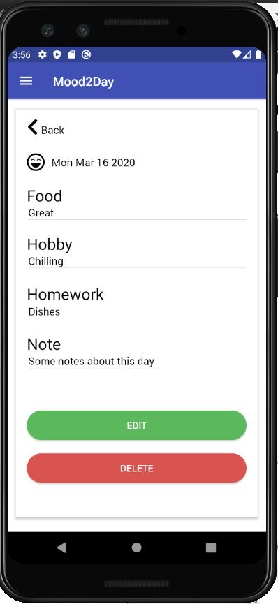

### 7. Edit Mood:
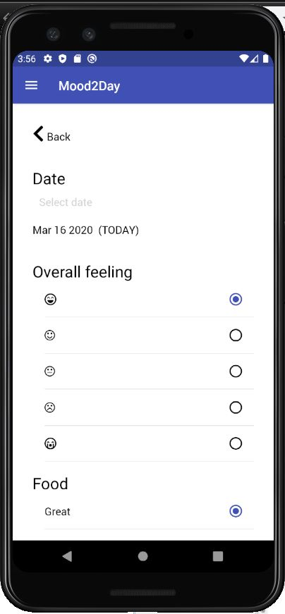

## 3.2 Hardware Interfaces ##
Android or iOS phone

## 3.3 Software Interfaces ##
- Node.js https://nodejs.org/en/
- react-native-cli https://www.npmjs.com/package/react-native-cli

## 3.4 Communication Interfaces ##
- Internet connection for authentication to work,

# 4 System Features #

## 4.1 Registration

For the application to work, the user must register a new account. User credentials are stored in Firebase.

## 4.2 Login

When user has a registered user account, they can login. Login happens using Firebase.

## 4.3 Creating a new mood

User can create a new mood, which means that they store information about a day. They say what the overall mood was on that day, what hobbies and activities they did and write a note for that day. When fields have been filled, user can finally submit the form. When form is submitted, the data is sent to Firestore database where mood for a specific date is stored. If user tries to store a new mood on same date as a previous mood, the newest one is kept and the old one is deleted. It only makes sense to have one mood for each day.

 

New mood fields 1/3

New mood fields 2/3

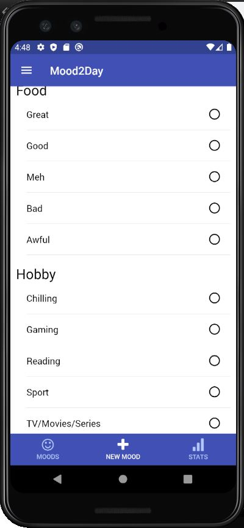

New mood fields 3/3

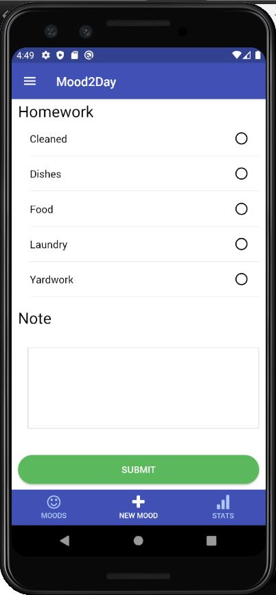

## 4.4 Moods

The first page shown when logged in is "Moods" page.

For finding a mood for a specific date, there is a calendar icon at the top of "Moods" page. When user clicks on this calendar icon, a modal with calendar is shown.

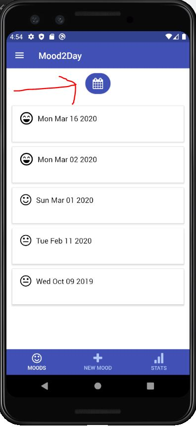

Calendar modal shows the dates when a mood has been added. When user presses on a date with a mood, user is taken to "Single Mood Page" that shows more details about that day.

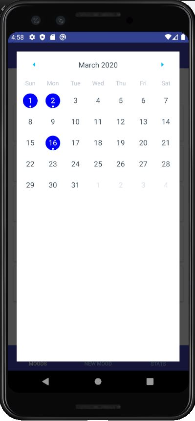

## 4.5 Single Mood

A single mood can be displayed, when clicking on a Mood teaser on "Moods" page (first page). On this page, the user can see all the mood details for a specific day. Also on this page, the user can choose to either update the mood details for that day, or choose to delete the mood. If deleted, the mood is deleted from Firestore cloud database.

 

Single Mood Page

## 4.6 Edit Mood

If user clicked the "update" button on Single Mood Page, they are taken to this page. This page is form similar to "New mood" page, where the form is prefilled with current mood data, and lets the user update this data by saving the form.

 

Edit Mood Page

# 5. Nonfunctional Requirements #
## 5.1 Performance Requirements ##
## 5.2 Safety Requirements ##
## 5.3 Security Requirements ##
## 5.4 Software Quality Attributes ##
## 5.5 Business Rules ##

# 6 Other Requirements #

<!--appendix-->
